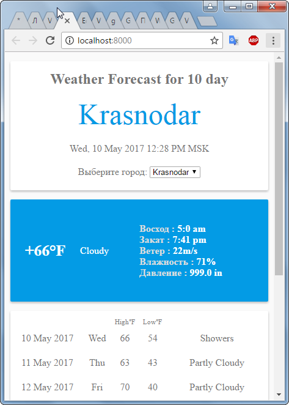

# Hello!

В данном проекте реализован простой погодный сайт на AngularJS с использованием Yahoo Weather API

This project implements a simple weather site on AngularJS using the Yahoo Weather API

## В данном проекте НЕ использовано:
 * Тестирование.
 * HTML, CSS Frameworks
 * Препроцессоры CSS
 * Ветвление

### Clone the repo:

`git clone https://github.com/VladimirValov/WeatherForecastFromYahoo-AngularJS.git`

### Install:

`npm install`

### Start:

`npm start`

### Open:
http://localhost:8000/

